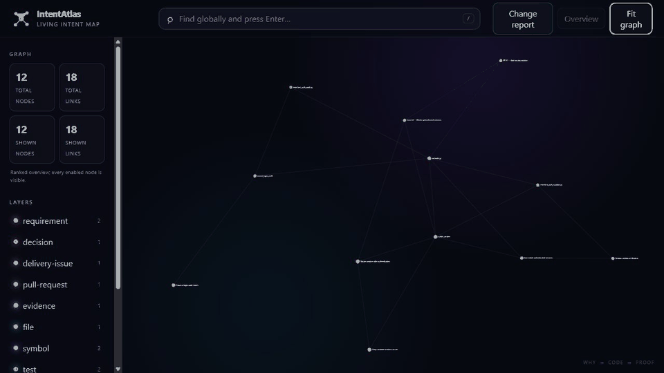

<p align="center">
  
</p>

<h1 align="center">IntentAtlas</h1>

<p align="center"><strong>Yazılım projeleri için yaşayan niyet haritası.</strong></p>

<p align="center">
  
  
  
</p>

<p align="center"><a href="README.md">English</a> · <a href="https://github.com/AhmetBugrahanAltunok/IntentAtlas/blob/main/atlas/Brain/Product%20Roadmap.md">Ürün yol haritası</a></p>

IntentAtlas bir değişikliğin **neden var olduğunu, hangi gereksinimi etkileyebileceğini ve hangi
testin buna dair kanıt taşıdığını** gösterir. Depoyu yerel olarak analiz eder; kaynak kodu yüklemez
ve API anahtarı istemez.

```text
Gereksinim → Karar → İş → Kod → Test → Kanıt → Commit
```

<p align="center">
  
</p>

## İlk demoyu iki dakikada görün

Gerekenler: Python 3.11, 3.12 veya 3.13. Git, gerçek depo analizi için gereklidir; yerleşik demo
için gerekli değildir. Kurulum adımı, derleme bağımlılıklarını almak için ayarlı Python paket
indeksinize bağlanabilir.

> **Windows: bu depoyu klonlamadan önce uzun yolları açın.** IntentAtlas kendi `atlas/` kasasını
> taşır ve üretilmiş sembol notlarının 51 tanesinin yolu 120 karakterden uzundur. Kısa olmayan bir
> klasöre klonlamak 260 karakterlik `MAX_PATH` sınırını aşar; checkout `Filename too long` ile
> durur ve çalışma ağacı boş kalır. Bir kez
> `git config --global core.longpaths true` çalıştırın ya da `C:\src\intentatlas` gibi kısa bir
> yola klonlayın. Bu yalnızca IntentAtlas'ı klonlamayı etkiler, analiz ettiği depoları değil.

İki dakikalık hedef, ilk metin demosu göründüğünde biter. Çıktıyı okumak ve aşağıdaki gerçek repo
akışlarını denemek daha uzun sürer.

IntentAtlas şu anda henüz yayımlanmamış bir beta sürümüdür. Ortam klasörünü bir kez seçin; `.venv`
başka bir kuruluma aitse ilk satırı `$IntentAtlasVenv = ".venv-intentatlas"` olarak değiştirin:

```powershell
$IntentAtlasVenv = ".venv"
python -m venv $IntentAtlasVenv
& "$IntentAtlasVenv\Scripts\python.exe" -m pip install .
& "$IntentAtlasVenv\Scripts\intentatlas.exe" demo --report text
```

Python var olan ortam klasörünü yeniden kullanır. Aşağıdaki kısa `intentatlas` komutları, yukarıda
seçilen klasör etkinleştirildikten sonra çalışır:

```powershell
& "$IntentAtlasVenv\Scripts\Activate.ps1"
```

macOS veya Linux'ta `IntentAtlasVenv=.venv` (veya başka bir ad) ayarlayın;
`$IntentAtlasVenv/bin/python` ile `$IntentAtlasVenv/bin/intentatlas` yollarını kullanın ve
`source "$IntentAtlasVenv/bin/activate"` çalıştırın. Etkinleştirme kullanılamıyorsa seçtiğiniz
klasördeki tam executable yolunu kullanın.

Demo mevcut klasörü taramaz ve ağa erişmez. Bir öneri ile kanıtını içeren küçük, yerleşik bir
senaryo yazdırır. Kısaltılmış çıktı:

```text
Exact changed symbol: rotate_session (src/auth.py)
Recommended tests:
- tests/test_auth_rotation.py [medium 80]
  Why: The test directly references an exactly modified symbol.
  Path: commit → rotate_session → tests/test_auth_rotation.py
```

`medium 80`, 80 puanın orta bantta olduğunu gösterir: low 0–64, medium 65–84, high 85–100.
Güven puanı mevcut yapısal kanıtı sıralar; doğruluk olasılığı değildir.

Rehberli akış gerçek bir etkileşimli terminal ister; pipe, yönlendirme ve etkileşimsiz kabukları
reddeder. Etkileşimsiz kabukta `intentatlas diagnose PATH` çalıştırın, ardından yazdırdığı kesin
**Next safe command** satırını kopyalayın. Yerel bir Git deposunu proje dosyalarına yazmadan
etkileşimli incelemek için:

```powershell
intentatlas guide C:\projenizin\yolu
```

Ya da açıkça onayladığınız public GitHub deposunu elle klonlamadan inceleyin:

```powershell
intentatlas guide https://github.com/OWNER/REPOSITORY
```

IntentAtlas Enter ile onay istemeden önce kesin kapsamı, güvenlik sınırlarını ve olası ağ/cache
etkisini gösterir. Sonuç; olası gereksinim etkisini, aday testleri, güven düzeyini ve kaydedilmiş
kanıt yolunu açıklar. Rehberden çıkmak için Quit seçeneğini kullanın; yerel görüntüleyiciyi
açarsanız terminal sürecini Ctrl+C ile durdurun. Bkz. [rehberli CLI turu](docs/guided-cli.md).

### Gerçek bir depodan örnek

Deponun incelenmiş benchmark'ında kullanılan sabit Click commit'i üzerinde salt-okunur rapor tek
bir test seçer ve kesin yapısal yolu açıklar. Kısaltılmış çıktı:

```text
$ intentatlas changes /click/deposunun/yolu --commit HEAD --report
Changed: __exit__ (src/click/core.py)
Run 1 test:

  tests/test_context.py   [medium confidence]
    The test references the owning symbol of an exactly modified nested symbol.
    __exit__ -> Context -> tests/test_context.py

No requirement is linked to this change.

Impact and test recommendations are bounded structural evidence, not proof that an
omitted requirement is unaffected or that a suggested test is sufficient.
Full detail: --explain    Machine-readable: --format json
```

`--explain` bu cevabın arkasındaki revizyonları, güven bantlarını, aday ve atlama sayılarını,
grafik kimliklerini ve kanıt etiketlerini ekler. `--format json` araçlar için değişmeyen şema-1
belgesidir; varsayılan bu özete dönerken ne JSON ne de `--explain` metni değişti.

Bu çıktı tavsiye niteliğindedir. Checkout yeniden üretilebilirlik için sabitlenmiş ve lisansı
incelenmiştir; proje kodu ve testler çalıştırılmaz. Bkz.
[gerçek dünya doğrulama protokolü](docs/real-world-validation.md).

## IntentAtlas nedir, ne değildir?

| IntentAtlas nedir? | IntentAtlas ne değildir? |
| --- | --- |
| Niyet, kod, test ve Git geçmişini bağlayan yerel bir kanıt grafiğidir | Kod üreten yapay zekâ veya otonom kodlama ajanı değildir |
| Kalıcı vault'u benimsemeden önce kullanılabilen salt-okunur değişiklik önizlemesidir | Deponuzu yükleyen barındırılmış bir servis değildir |
| Güven düzeyi açıklanmış test öneri aracıdır | Test çalıştırıcısı veya önerilen testlerin yeterli olduğuna dair kanıt değildir |
| Git'te saklanabilen, isteğe bağlı Markdown/Obsidian proje hafızasıdır | Git'in, issue tracker'ın, CI'ın veya Obsidian'ın yerine geçmez |

Gösterilmeyen bir gereksinimin etkilenmediği, gösterilmeyen bir testin de gereksiz olduğu kanıtlanmış
olmaz. IntentAtlas mevcut yapısal kanıtı görünür kılar ve kanıt yeterli değilse iddiada bulunmaz.

Güncel fazlar ve tamamlanma durumları
[Ürün Yol Haritası](https://github.com/AhmetBugrahanAltunok/IntentAtlas/blob/main/atlas/Brain/Product%20Roadmap.md) belgesinde izlenir. Repo kökündeki
`ROADMAP.md`, ilk 0.1–0.3 teknik planının açıkça arşivlenmiş tarihsel kaydıdır.

## Beta durumu

Mevcut kaynak kendisini `0.3.0b1` olarak tanımlar. Henüz tag'lenmemiş, paket indeksinde
yayımlanmamış ve uyumluluk sözü vermemiştir. Yukarıdaki hızlı yol mevcut checkout'un davranışını
doğrular; release incelemesi ayrıca kesin revision'ı, tekrarlanabilir artifact'leri, provenance'ı,
hash'leri, kurulu wheel'i ve browser akışını doğrular. Bkz. [kurulum durumu](docs/installation.md)
ve [sürüm süreci](RELEASING.md).

## Hızlı başlangıç

### İlk komutu seçin

| Durumunuz | Kullanın | Projeye yazılanlar | Ağ |
| --- | --- | --- | --- |
| Yalnız fikri görmek istiyorsunuz | `intentatlas demo --report text` | Yok | Yok |
| Etkileşimli terminaliniz var | `intentatlas guide PATH` | Yok | Yerel yol için yok |
| Etkileşimsizsiniz veya Git kapsamından emin değilsiniz | `intentatlas diagnose PATH`, ardından **Next safe command** (`intentatlas changes ...`) | Yok | Yok |
| Kalıcı proje haritası istiyorsunuz | `intentatlas init PATH`, ardından `intentatlas scan PATH` | `intentatlas.json`, `.gitignore`, `.intentatlas/` ve `atlas/` | Yok |

Yalnız açıkça onaylanan public GitHub URL'si ağ ve yönetilen işletim sistemi cache'ini kullanabilir.
Paket kurulumu da ayarlı Python paket indeksine bağlanabilir; yerel analiz çevrimdışıdır.

Etkileşimli terminalde gerçek bir repo içinden tek komut çalıştırın:

```powershell
intentatlas
```

IntentAtlas analizden önce en yakın güvenli Git kökünü ve ihtiyatlı kapsamı gösterir. Kabul etmek
için bir kez Enter'a basın. Conflict, unstaged veya untracked durum `worktree`; yalnız staged durum
`staged`; temiz repo exact `HEAD`; unborn repo `worktree` seçer. Sonuç production Change Report'u
kullanır ve hiçbir şey yazmaz. Pipe, redirect, CI veya başka non-TTY çağrılar mevcut argparse
stderr/exit-2 davranışını korur; prompt açmaz ve tarama yapmaz. Açık bir yol için aynı akışı
`intentatlas guide [PATH]` ile başlatın. Ayrıntılar [rehberli CLI sözleşmesindedir](docs/guided-cli.md).

Etkileşimli çıktı büyük bir IntentAtlas başlığı; açık kaynak/güvenlik/analiz/öneri/Atlas bölümleri;
satıra sığdırılmış kanıt ve her satırda tek seçenek kullanır. Browser viewer'da **Change report** ve
**Fit graph** tekrarlandığında sayfa ile graph geometrisi sabit kalır.

Public bir GitHub repository'yi elle clone etmeden analiz etmek için gerçek bir etkileşimli
terminal kullanın:

```text
intentatlas https://github.com/OWNER/REPOSITORY
# veya: intentatlas guide https://github.com/OWNER/REPOSITORY
```

IntentAtlas ağ veya cache etkisinden önce normalize URL'yi, yönetilen cache yazmasını,
shallow/resource sınırlarını ve devre dışı çalıştırma davranışını gösterir. Yalnız boş Enter onay
verir. Sonuç exact cache revision'ını gösterir ve aynı production no-write Change Report ile
immutable viewer snapshot'ını kullanır. Private/authenticated repository, redirect, repository
sayfası URL'si, hook, filter, LFS, submodule ve proje kodu çalıştırma desteklenmez. Ayrıntılar
[yönetilen repository cache belgesindedir](docs/managed-repository-cache.md).

Exact aday wheel'i geçici pipx köklerinde install/reinstall/uninstall kapısından geçer; ancak paket
yayımlanmamıştır ve sıfır-önkoşullu Windows installer yoktur. Bkz.
[kurulum durumu](docs/installation.md).

Hiçbir depoya dokunmadan paketlenmiş sentetik sözleşmeyi değerlendirmek için:

```powershell
intentatlas demo --report text
intentatlas demo --report json
intentatlas demo
```

Yerleşik örnek özgün, çevrimdışı ve geçicidir. Sentetik grafiği ve ilişkileri önceden hazırlanır;
üretim graph, öneri, rapor ve görüntüleyici katmanlarını çalıştırır ancak repo keşfi, AST ayrıştırma
veya Git diff çıkarımını sınamaz. İnteraktif görünümde **Change report** düğmesini açarak seçilen
`tests/test_auth_rotation.py` testini, gösterilen uyarı sınırını ve grafikte bulunmasına rağmen
sıralanmayan `tests/test_auth_audit.py` testini karşılaştırın. Ayrıntılı tur için
[yönlendirmeli demo belgesine](docs/guided-demo.md) bakın. Geçerli klasörü taramaz.

Açık uzman komutları sıfır-izli önizleme için kullanılmaya devam eder:

```powershell
intentatlas diagnose C:\projenizin\yolu
# Sonra yazdırdığı kesin Next safe command satırını çalıştırın. Örnekler:
intentatlas changes C:\projenizin\yolu --worktree --report
intentatlas changes C:\projenizin\yolu --commit HEAD --report --format json
```

Bu komutlar çevrimdışı ve salt okunurdur. Tanı; sınırlı yetenekleri, belirsizliği, kanıt
hazırlığını ve sonraki güvenli komutu bildirir. Rapor kesin revision/kapsamı, güncelliği, güven
eşiğini, seçilen ve atlanan adayları, kaydedilmiş sıralama yollarını ve yedek test stratejisini
gösterir. Atlanmak, niyetin etkilenmediğini veya testin gereksiz olduğunu kanıtlamaz. Kayıtlı
grafik varsa `diagnose`, bulunan Python test dosyası ve kesin `python-symbol-reference`
bağlantısı sayılarını da gösterir. `missing-exact-links`, testlerin bulunduğu fakat kesin sembol→test
bağının kurulmadığı anlamına gelir; hazır sonucu değildir. Grafik güncelliği yine ayrıca doğrulanmaz.
Sonraki komut için `diagnose`; unstaged, untracked veya conflicted değişikliklerde `worktree`, yalnız
index değiştiğinde `staged`, çalışma kopyası temizse exact `HEAD`, henüz commit yoksa `worktree`
seçer. Böylece kirli çalışma kopyası yanlışlıkla commit edilmiş `HEAD` görüntüsü sanılmaz.
Yalnız açıkça verilen `--open`, aynı bellek içi rapor anlık görüntüsü için loopback görüntüleyicisini
başlatır.
[Güven-öncelikli önizleme](docs/trust-first-preview.md) ve [belge dizini](docs/index.md) ayrıntıları
açıklar.

Önizlemeyi yorumladıktan sonra kalıcı vault akışını bilinçli olarak benimseyin:

```powershell
intentatlas init C:\projenizin\yolu
intentatlas scan C:\projenizin\yolu
intentatlas open C:\projenizin\yolu
```

Aktif reponuza henüz yazmak istemiyorsanız bu üç komutu önce atılabilir bir kopya veya küçük test
reposunda deneyin. `init`; `intentatlas.json`, başlangıç Markdown klasörleri, taşınabilir Obsidian
ayarları ve eksik yerel-durum `.gitignore` kurallarını oluşturur. `scan`, atılabilir `.intentatlas/`
cache'ini ve `atlas/` altındaki üretilmiş alanları yazar; proje kodunu çalıştırmaz ve kullanıcıya
ait notların üzerine yazmaz. Her şeyi commit etmeden önce `git status` ile inceleyin.

`init`, genel yönlendirme ile boş niyet klasörleri oluşturur; IntentAtlas'ın kendi gereksinim,
karar, kanıt, inceleme veya tarihli oturumlarını hedef depoya örnek veri olarak eklemez.
Mevcut `.gitignore` dosyasını korur; yalnız `.intentatlas/`, `.venv-intentatlas/` ve Obsidian'ın
makineye özel workspace/cache dosyaları için eksik kuralları ekler. Kalıcı `atlas/` notları ve
taşınabilir Obsidian ayarları Git tarafından izlenebilir kalır.
Obsidian isteğe bağlıdır: `atlas/` kalıcı akışın Markdown katmanıdır; Obsidian kurmadan aynı
üretilmiş grafiği `intentatlas open` ile inceleyebilirsiniz.

`status`, `impact`, `recommend-tests`, `diff` ve öneri değerlendirme komutları kalıcı grafiği okur;
bu nedenle önce `scan` çalıştırılmalıdır. `diagnose`, `guide` ve `changes --report` kendi salt-okunur
incelemesini yapar ve kayıtlı grafik gerektirmez.

`impact` için `TARGET`; kesin grafik kimliği (`commit:TAM_SHA` veya
`symbol:src/auth.py::rotate_session`), `src/auth.py` gibi proje-göreli yol, kesin etiket veya tekil
kısmi eşleşme olabilir:

```text
intentatlas impact src/auth.py C:\projenizin\yolu --depth 2
intentatlas impact symbol:src/auth.py::rotate_session C:\projenizin\yolu --direction upstream
```

Çıktıdaki her iki boşluk, asıl hedeften bir ilişki hop'u demektir. Satırlar düz bir traversal
sonucudur; girintili satır hemen üstündeki satırın çocuğu değildir.
İsteğe bağlı `[PATH]` verilmezse komutlar geçerli klasörü kullanır. `impact` ve `recommend-tests`,
yanlış klasörün grafiği kullanılıyorsa bunun görülebilmesi için çözümlenen proje kökünü yazdırır.

Tekrarlanan CLI taramaları, değişmeyen her yerleşik dil adaptörü için sınırlı ve içerik-karmalı bir
parçayı yeniden kullanır. Komut, yeniden kullanılan ve yeniden üretilen adaptör sayılarını gösterir.
Bu cache kaynak metni değil yalnızca grafik metadata'sını taşır ve güvenle silinebilir; bozuk veya
eski kayıt yeniden üretilir. Grafik ve cache dosyaları atomik olarak değiştirilir. Ayrıntılar için
[artımlı tarama belgesine](docs/incremental-scanning.md) bakın.

Yönetilen public GitHub cache kayıtlarında önce kimliği listeleyin, sonra kesin kimliği kullanın:

```text
intentatlas cache list
intentatlas cache info CACHE_ID
intentatlas cache clear CACHE_ID
```

Obsidian kullanıyorsanız `atlas/` klasörünü vault olarak açın. Graph View; gereksinimleri, kararları,
kodu, testleri, kanıtları ve commit’leri renkli, bağlantılı düğümler olarak gösterecektir.

macOS veya Linux'ta `/projenizin/yolu` gibi açık bir hedef yol kullanın. Ortam etkin değilse
kurulumda seçtiğiniz ortam klasörünün içindeki `intentatlas` executable'ını çağırın.

Python 3.11, 3.12 ve 3.13 desteklenir. Tam test paketi Linux üzerinde; kurulmuş wheel ile CLI,
tarama, test önerisi ve yerel görüntüleyici akışı ise en eski ve en yeni desteklenen Python
sürümlerinde Linux, Windows ve macOS üzerinde CI tarafından doğrulanır. Yerel, tekrarlanabilir
paket kontrollerine ek olarak sabit tohumlu property/mutasyon testleri, gerçek Chrome tabanlı
görüntüleme, statik tip ve değişmez Action referansı kapıları uygulanır. Doğrulanan paket
hash'lerini kesin Git revision ve sabit derleme zamanına bağlayan deterministik provenance kaydı
üretilir; yayınlama ayrı onay gerektirir. Ayrıntılar için [sürüm sürecine](RELEASING.md) bakın.

Pull request veya CI denemelerinde aynı değişiklik analizi salt-okunur gölge modunda çalıştırılabilir:

```text
intentatlas review --base origin/main --head HEAD
intentatlas review --base origin/main --head HEAD --format json
intentatlas review --base origin/main --head HEAD --format sarif
intentatlas review --base origin/main --head HEAD --test-outcomes .intentatlas/test-outcomes.json
intentatlas review --base origin/main --head HEAD --open
```

Komut aynı revision-aralığı ChangeSet ve Change Report verisini kullanır. Geçerli bulgular süreci
başarısız yapmaz; pull request yayımlamaz veya değiştirmez, sağlayıcı kimlik bilgisi ve ağ erişimi
istemez. SARIF yalnız güvenli proje-göreli konumları ve hunk satır aralıklarını taşır; kaynak
parçası veya mutlak yol içermez. Sınırlar [CI gölge inceleme belgesinde](docs/ci-shadow-review.md)
açıklanır.

İsteğe bağlı outcome JSON’u tam commit kimliğiyle eşleşirse seçilen ve gerçekten çalıştırılan test
yolları gözlemsel olarak karşılaştırılır. Commit farklıysa veri `stale` kalır ve karşılaştırma
üretilmez; bu kümeler doğruluk, zorunluluk veya yeterlilik iddiası değildir.
`--open`, komutun kullandığı aynı bellek içi grafik ve review raporunu yerel arayüzde açar.

Aynı deterministik ChangeSet şeması commit, revision aralığı, index veya mevcut çalışma ağacını
kapsar:

```text
intentatlas changes --commit HEAD
intentatlas changes --base main --head HEAD --format json
intentatlas changes --staged
intentatlas changes --worktree
intentatlas changes --staged --analyze --format json
intentatlas changes --staged --report --format json
intentatlas changes --worktree --report --open
```

Neyi incelemek istediğinize göre kapsam seçin: `--worktree` mevcut staged, unstaged ve untracked
değişiklikleri birlikte kapsar; `--staged` yalnız index'i; `--commit HEAD` commit edilmiş HEAD
görüntüsünü inceler ve etkilenen dosyaların hâlâ o revision ile eşleşmesini bekler. Kirli repoda
tahmin yürütmek yerine `diagnose` çıktısındaki komutu kullanın.

| Çıktı terimi | Anlamı |
| --- | --- |
| `aligned` | Seçilen değişiklik tarafı, güvenle taranan mevcut dosyayla eşleşiyor. |
| `stale` | Seçilen commit/index içeriği mevcut dosyadan farklı; kesin iddialardan kaçınılıyor. |
| `analyzed` | Değişen dosya için desteklenen kesin artifact kanıtı kuruldu. |
| `fallback` | Yalnız daha geniş dosya-seviyesi kanıt var; gösterilen tam-paket politikasını izleyin. |
| `unknown` | Artifact güvenle eşleştirilemedi veya analiz edilemedi; hedefli yeterlilik iddiası yok. |

`--analyze`, dosya başına durum, güncellik, güven ve artifact kimliklerini verir. `--report`, aynı
taze analize ek olarak gereksinim etkilerini ve testleri sıralar, test stratejisini seçer ve
atlamaları açıklar. `--report --open`, aynı bellek-içi raporu yerel görüntüleyicide gösterir.

`--open`, aynı bellek içi raporu ikinci bir grafik veya rapor dosyası kaydetmeden yalnızca yerel
arayüzde açar.

Çıktı yalnız durumları, güvenli proje-göreli yolları, çözümlenmiş commit kimliklerini ve yeni taraf
satır aralıklarını taşır; ham diff satırlarını saklamaz. Worktree modu ignore kurallarına uyan
takip edilmeyen yolları gösterir ancak içeriklerini okumaz veya yazmaz. `--analyze`, açıkça yeni ve
sınırlı bir yerel tarama yaparak her dosyayı `analyzed`, `fallback` veya `unknown`; güncelliği
`aligned` veya `stale` olarak işaretler ve güven, eser kimliği ile kanıtı gösterir. Bu seçenek normal
tarayıcı üzerinden desteklenen çalışma ağacı dosyalarını okuyabilir ancak proje kodunu çalıştırmaz
ve ham kaynağı saklamaz. Yapılandırılmış vault'un `Private/` alanı Git meta verisi toplanmadan önce
kapsam dışında bırakılır.

`--report` aynı hizalanmış analizi kullanarak olası gereksinim etkilerini ve aday testleri sıralar.
Kesin sembol-niyet yolu varsayılan orta güven eşiğine ulaşabilir; yalnızca aynı dosyada bulunmaya
dayanan ilişki düşük güvenli kalır. `fallback` durumunda hedefli testler tek başına yeterli sayılmaz
ve tam test paketi de istenir. `unknown` durumunda sistem sıralama iddiasından kaçınır ve tam test
paketine yönlendirir. Rapor tavsiye niteliğindedir; listede olmayan gereksinim veya testlerin
etkilenmediğini kanıtlamaz.

Bir commit, dosya veya sembol için test dosyalarını çalıştırmadan sıralamak için:

```text
intentatlas recommend-tests commit:TAM_SHA --minimum-confidence medium
intentatlas recommend-tests src/auth.py --minimum-confidence low --format json
```

Puanlar sabit ve incelenebilir yapısal kanıtlara dayanır. Kesin sembol değişikliği ile kesin statik
test bağlantısı, yalnız dosya veya adlandırma kuralı kanıtından daha yüksek sıralanır. Dosya
düzeyindeki bir ilişki, aynı dosyadaki ilgisiz bir sembol için varsayılan orta güvenli iddiaya
dönüşmez; bu yedek kanıt düşük güvenli kalır veya çelişen kesin sembol kanıtı varsa elenir.
Sonuçlar tavsiyedir; listede olmayan bir test, davranışın etkilenmediğini kanıtlamaz.

Tam IntentAtlas repo checkout'unda, öneri kalitesini eksiksiz olduğu açıkça belirtilen insan
incelemeli yerel etiketlerle ölçmek için:

```text
intentatlas evaluate-recommendations benchmarks/intentatlas-recommendations.json
intentatlas evaluate-recommendations benchmarks/intentatlas-recommendations.json --minimum-confidence high --format json
```

Değerlendirme testleri çalıştırmadan ve sıralama puanlarını değiştirmeden TP, FP, FN, precision ve
recall üretir. Yalnız tam repoda bulunan iki vakalık temel ölçüm regresyon yardımcısıdır; sdist
corpus'una dahil değildir ve başka repolardaki doğruluğu kanıtlamaz. Şema ve metrik sözleşmesi
[değerlendirme belgesinde](docs/recommendation-evaluation.md) açıklanır.

Özgün Python, TypeScript ve Go grafik senaryolarında bütün güven eşiklerini karşılaştırmak için:

```text
intentatlas evaluate-corpus benchmarks/recommendation-corpus.json
intentatlas evaluate-corpus benchmarks/recommendation-corpus.json --format json
```

Corpus çıktısı proje başına ve mikro toplamları birlikte gösterir. Bu küçük özgün fixture’lar
agregasyon ile güven davranışını doğrular; kopyalanmış repo veya gerçek dünya doğruluk kanıtı
değildir. Ayrıntılar [corpus şemasında](docs/recommendation-corpus.md) bulunur.

Tam IntentAtlas repo checkout'unda lisansı incelenmiş gerçek projelerle yeniden üretilebilir
doğrulama için, onaylı altı açık kaynak depoyu yalnızca ağ izninden sonra yalnız repoda bulunan
manifestteki commit’lere sabitleyin ve şunu çalıştırın:

```text
intentatlas evaluate-real-world benchmarks/real-world/manifest.json .intentatlas/real-world/checkouts
```

Komut taramadan önce origin, commit, temiz çalışma ağacı ve incelenmiş lisans özetini doğrular.
Repo klonlamaz, bağımlılık kurmaz, test veya proje kodu çalıştırmaz; üçüncü taraf kaynak, Git
geçmişi, logo ya da üretilmiş grafiği üründe saklamaz. Ayrıntılar
[gerçek proje doğrulama protokolünde](docs/real-world-validation.md) bulunur. On sekiz sabit vaka
yalnızca seçilen Python, JavaScript ve Go değişiklikleri için kanıttır; genel doğruluk iddiası
değildir.

Bir projeyi okumadan veya çalıştırmadan çevrimdışı ölçek kontrolü yapmak için:

```text
intentatlas benchmark-scale
intentatlas benchmark-scale --unrelated-edges 50000 --iterations 500 --format json
```

Benchmark kararlı grafik/sonuç/iş sayılarını ve ortama bağlı süreleri raporlar. Taşınabilir gecikme
garantisi değil, regresyon ve tanılama aracıdır. Ayrıntılar
[ölçek benchmark sözleşmesinde](docs/query-scale-benchmark.md) bulunur.

Yerel görüntüleyici, seçilen düğümden testlere, kanıtlara, coverage sonuçlarına, test sonuçlarına,
commit'lere ve pull request'lere giden sınırlı en kısa yapısal yolları da gösterir. Bu yollar grafik
bağlantısını açıklar; nedensellik, eksiksizlik, güncellik veya test zorunluluğu iddia etmez.
`intentatlas demo`, aynı üretim görüntüleyicisini aynı-dosya karşı örneği içeren on iki düğümlü
özgün bir grafik üzerinde açar ve görüntüleyici kapandığında geçici grafiği temizler.
`intentatlas demo --report text` ve `--report json`, listener başlatmadan aynı sınırlı kanıt
hikâyesini üretir.

Büyük depolarda görüntüleyici, grafiğin tamamını yerel gezinme için bellekte korur; aynı anda en
fazla 240 düğüm ve 900 kenardan oluşan deterministik bir pencere çizer. Genel görünüm katmanları
dengeler; genel arama, rapor ve ilişki bağlantıları gizli bir düğümün iki adımlı sınırlı çevresini
açabilir. Toplam/gösterilen sayıları görünür kalır ve ilişki ayrıntıları sınırsız tarayıcı öğesi
üretmek yerine kaç sonucun gösterilmediğini açıkça belirtir.

Adapter conformance sözleşmesi sürüm 1, ortak adapter sınırını çalıştırılabilir bir denetime
dönüştürür. Yeni ve cache’den okunan fragment’lar grafiğe katılmadan önce aynı sınırlı sembol,
ilişki, uç nokta, kanıt, sıralama ve determinizm kurallarını geçmelidir. Built-in adapter’lar aynı
fixture tabanlı yardımcıyla doğrulanır; bu özellik harici plugin yükleyicisi değildir. Ayrıntılar
[dil adapter conformance belgesinde](docs/adapter-conformance.md) bulunur.

## Temel yaklaşım

- Klasörler amaca göre, bağlantılar anlama göre düzenlenir.
- İnsan/ajan notları ile tarayıcının ürettiği kod notlarının sahipliği ayrıdır.
- `Issues/` dahil kalıcı niyet notları kullanıcıya aittir ve taramalarda korunur.
- `Private/` Git’e girmez ve IntentAtlas tarafından okunmaz.
- Kalıcı ama bağlantısız notlar sağlık sorunu olarak raporlanır.
- Obsidian zorunlu değildir; aynı grafik yerel web görünümünde açılabilir.

Üretilmiş notların senkronizasyonu, dosyalara dokunmadan önce hedef görünümün tamamını hazırlar.
Bayt düzeyinde aynı notları yeniden yazmaz; değişen notları geçici dosya kilitleri için sınırlı
tekrarlarla atomik olarak değiştirir ve eski notları ancak bütün hedef notlar yerindeyken siler.
Kalıcı hata bu nedenle önceki üretilmiş görünümü baştan silmeden açıkça raporlanır.

Anlamı belirtilmiş bağlantılar `relation:: [[hedef]]` biçimini kullanır. Normal wikilinkler
güvenli ve genel `references` ilişkileri olarak çalışmaya devam eder.

## Durum

Python, TypeScript/JavaScript ve Go analizi aynı dil-bağımsız adaptör sözleşmesini kullanır. `.ts`,
`.tsx`, `.js` ve `.jsx` dosyalarında adlandırılmış semboller, yerel import/re-export bağlantıları
ve test ilişkileri çıkarılır. Go adaptörü `.go` dosyalarını, `go.mod` modül sınırlarını,
adlandırılmış türleri, fonksiyonları, metotları, modül-içi paket importlarını ve testleri kapsar.
Aynı klasördeki testler yalnızca tek bir üretim dosyasına ait, gerçekten başvurulan dışa açık
bildirimler için yapısal kanıt kazanır; belirsiz adlar bağlanmaz ve dosya adı eşleşmesi zayıf yedek
olarak kalır. Hiçbir adaptör dil çalışma zamanını veya proje kodunu çalıştırmaz.
Doğrudan test edilen bir Go sarmalayıcısı değişen sembolü çağırıyorsa yalnızca bir kesin
`calls`/`called-by` adımı izlenir; sınırsız çağrı grafiği yayılımı yapılmaz.

İsteğe bağlı Cobertura coverage ve JUnit test raporları `intentatlas.json` içindeki proje-göreli
`coverage_reports` ve `test_reports` listeleriyle içe aktarılabilir. IntentAtlas testleri çalıştırmaz;
yalnızca dosya başına sınırlı özetleri grafiğe ekler. `intentatlas diff` komutu da mevcut grafiği bir
temel grafikle karşılaştırarak CI için deterministik ve zaman damgasız JSON üretir.

SCIP protobuf-JSON, SARIF 2.1.0 ve commit-kimli test execution map raporları da sırasıyla
`scip_reports`, `sarif_reports` ve `test_execution_reports` listeleriyle açıkça etkinleştirilebilir.
İkili SCIP bu fazda desteklenmez. SCIP ve SARIF yalnız dosya gözlemi olarak kalır; etki veya test
zorunluluğu iddiası üretmez. Execution map yalnız tam commit kimliği güncel Git HEAD ile eşleşir ve
eşlenen tüm dosyalar o HEAD'e göre takip edilen/değişmemiş durumdaysa testten kaynak dosyaya
çalışma-zamanı kanıtı ekler; eski ya da kimliği çözülemeyen rapor önerileri etkilemez. Ham semboller,
tanılar, mesajlar, snippet'ler, düzeltmeler, kod akışları ve kaynak metni
saklanmaz. Ayrıntılar [açık kanıt belgesinde](docs/open-evidence.md) açıklanır.

Issue ve pull request bağlamı da isteğe bağlı yerel JSON snapshot dosyalarından içe aktarılabilir.
`delivery_reports` kaynakları gereksinim ve kararları issue, pull request, değişen dosya ve bilinen
commitlerle bağlar. Gövdeler, yorumlar ve ham API yanıtları saklanmaz; ayrıntılar
[yerel teslimat şemasında](docs/delivery-schema.md) açıklanır.

Yakın Git geçmişinde değişen yeni taraf satırları, doğrulanmış AST aralıklarıyla kesiştiğinde ve
güncel dosya incelenen commit blobuyla eşleştiğinde Python sınıf, fonksiyon ve metot sembollerine
doğrudan `modifies` ilişkisi eklenir. Eski dosya sürümü, silme, modül-seviyesi değişiklik, span
desteği olmayan adaptör veya belirsizlik durumunda mevcut dosya-seviyesi `changes` ilişkisi güvenli
yedek olarak korunur.

`recommend-tests`, doğrulanmış grafik ilişkilerinden test dosyalarını `high`, `medium` veya `low`
güvenle sıralar. Manifesti olmayan kök `src/` düzeninde hem `from auth import ...` gibi geleneksel
hem de `from src.auth import ...` gibi namespace importları tek bir yerel modülü gösterdiğinde
çözülür. Setuptools, Hatch veya Flit source-root bilgisi taşıyan `pyproject.toml` varsa bu bilgi
önceliklidir. Belirsiz modül veya sembol kimlikleri bilinçli olarak bağlanmaz; kesin Python
sembol→test bağlantılarını görmek için `scan` sonrasında `diagnose` çalıştırın.
güvenle sıralar ve her sonucun neden yolunu gösterir. Python testleri, sınırlı paket yeniden
dışa-aktarımları üzerinden tam içe aktarılan sembole bağlanabilir; iç içe bir değişiklikte test adı
uyuşuyorsa sahibi olan sembolün odaklı testi kullanılabilir. JavaScript/TypeScript için adlandırılmış
ve varsayılan statik içe aktarımlar kaydedilir; yalnızca tam sembolü içe aktaran tek bir bağımlı
kaynaktan doğrudan bağlı teste gidilir. Seçilen dosya veya sembolün en son incelenen dar
eş-değişimindeki testler ayrı bir düşük-güven kanıtıdır; 20 artifact'tan geniş commitler abstain
eder. Yalnız filename eşleşmesine dayanan ikinci hop düşük kalır. Python dosyaları ancak sınırlı
pytest filename desenleri ile güvenle okunan `python_files` veya `testpaths` bildirimleri bu rolü kanıtlarsa
doğrudan çalıştırılabilir hedeftir; `conftest.py`, package marker, typing fixture ve eşleşmeyen
ilan edilmiş test köklerinin dışındaki dosyalar ve diğer support dosyaları graph artifact olarak kalır fakat çalıştırılacak komut diye sunulmaz.
JavaScript/TypeScript ve Go mevcut adapter davranışını korur.

`low` keşif modudur: zayıf filename, fallback ve co-change sinyalleri yüksek fan-out ve düşük
precision üretebilir. Otomatik CI seçimi için `medium veya üzeri` eşik kullanın; varsayılan ve
guided akış `medium` kalır. Exact statik direct-reference bilinçli olarak `80/medium` değerindedir;
`high`, doğrudan değişiklik kümesi içindeki test gibi daha güçlü kanıtlara ayrılmıştır. Sorgu
sınırsız geçişli dolaşım yapmaz.

`evaluate-recommendations`, aynı üretim sorgusunu değiştirmeden katı ve kapalı-dünya yerel
etiketleriyle karşılaştırır. Zaman damgasız şema-1 çıktısı eşik farklarını ve regresyonları görünür
kılar; tanımsız metrikleri açıkça `null`/`n/a` olarak korur.

`evaluate-corpus`, aynı sorguyu birden fazla kayıtlı grafiğe uygular ve `low`, `medium`, `high`
eşiklerini yan yana raporlar. Herhangi bir grafik veya etiket geçersizse corpus’un tamamı açıkça
başarısız olur; eski veya bozuk bir proje toplam metriği sessizce iyileştiremez.

Etki ve test önerisi sorguları aynı tembel ve deterministik adjacency indeksini kullanır. Tekrarlı
yerel sorgular yalnız eşleşen giriş/çıkış bucket’larını inceler; yeni kenar eklenirse bellek içi
indeks geçersizleştirilip güvenle yeniden kurulur.

Vault-first hafıza yaklaşımı
[breferrari/obsidian-mind](https://github.com/breferrari/obsidian-mind) projesinden
esinlenmiştir. IntentAtlas buna kod, test, Git ve teslimat niyeti katmanını ekler.
Üçüncü taraf kaynak kodu, logosu veya vault içeriği paketlenmez.

MIT lisanslıdır. Katkı göndermeden önce [CONTRIBUTING.md](CONTRIBUTING.md) belgesini okuyun.
